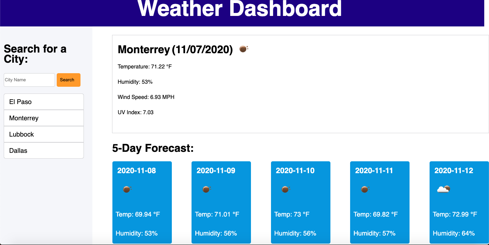

# Weather Dashboard
this week we were promtoed to create a weather dash board or app
this weather app is composed of html css JS and API to recieve different data from different cities
the weather app can store cities that the user searched for and will stay there if the user needs to click on them again to get the weather 
 launched link 
 https://jayjay2397.github.io/WeatherDashboard/

